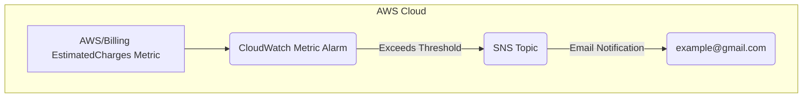

```mermaid
graph TD
    subgraph "AWS Cloud"
        A[AWS/Billing EstimatedCharges Metric] --> B(CloudWatch Metric Alarm);
        B -- Exceeds Threshold --> C(SNS Topic);
        C -- Email Notification --> D("example@gmail.com");
    end
```