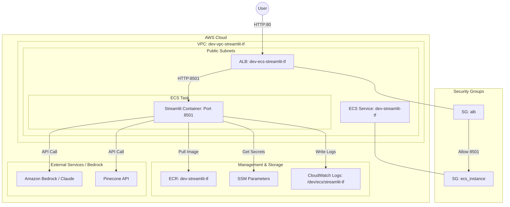

# ECS Streamlit Architecture

```mermaid
graph TB
    subgraph AWS_Cloud [AWS Cloud]
        subgraph VPC [VPC: dev-vpc-streamlit-tf]
            subgraph Public_Subnets [Public Subnets]
                ALB[ALB: dev-ecs-streamlit-tf]
                ECS_Service[ECS Service: dev-streamlit-tf]
                
                subgraph ECS_Task [ECS Task]
                    Streamlit_Container[Streamlit Container: Port 8501]
                end
            end
        end

        subgraph Management_Services [Management & Storage]
            ECR[ECR: dev-streamlit-tf]
            SSM[SSM Parameters]
            CWL[CloudWatch Logs: /dev/ecs/streamlit-tf]
        end

        subgraph External_Services [External Services / Bedrock]
            Bedrock[Amazon Bedrock / Claude]
            Pinecone[Pinecone API]
        end
    end

    User((User)) -->|HTTP:80| ALB
    ALB -->|HTTP:8501| Streamlit_Container
    
    Streamlit_Container -->|Pull Image| ECR
    Streamlit_Container -->|Get Secrets| SSM
    Streamlit_Container -->|Write Logs| CWL
    
    Streamlit_Container -->|API Call| Bedrock
    Streamlit_Container -->|API Call| Pinecone

    %% Security Groups
    subgraph Security_Groups [Security Groups]
        SG_ALB[SG: alb]
        SG_ECS[SG: ecs_instance]
    end

    ALB --- SG_ALB
    ECS_Service --- SG_ECS
    SG_ALB -->|Allow 8501| SG_ECS
```
